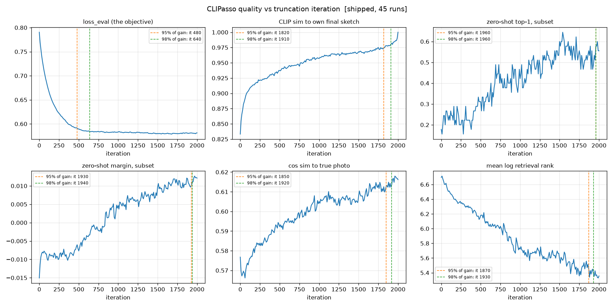

# CLIPasso Speed-Up — Results Log

Single source of truth for what has been tried. Every change gets a
**(speedup, quality delta)** pair. Negative results stay in the table.

Reproduce anything here with the scripts in [`bench/`](bench/). All numbers below
come from the harnesses, not from estimates.

---

## Summary — current state

**3.44× cumulative, no measurable quality cost**, on n=16 over the fixed 5-image eval set × 3 seeds.

| # | change | marginal | cumulative | s/seed | quality |
|---|---|---:|---:|---:|---|
| — | baseline as shipped | — | 1.00× | 126.3 | — |
| 0.2 | release the per-iteration autograd graph | 1.48× | 1.48× | 85.3 | inside noise floor |
| 1.1 | batch the 3 seeds into one process | 1.67× | 2.47× | 51.1 | inside noise floor |
| 0.1 + 0.3 | freeze the CLIP encoder + skip the unused `CLIPLoss` | 1.28× | 3.16× | 40.0 | inside noise floor |
| 1.2 | batch across images (M=5) | 1.09× | **3.44×** | 36.7 | inside noise floor |

Measured against the like-for-like unpatched arm (`nolog`, 117.7 s/seed) rather than the
fully-logged default, the cumulative figure is **3.21×**. Both are stated because the
default ships with logging on.

**Verified but not yet in the ladder** (opt-in, pending one clean re-measurement on an idle GPU):

| # | change | effect | quality |
|---|---|---:|---|
| 0.4 | strip diffvg's per-shape `isfinite` asserts | 1.03× idle / 1.13× shared; render forward 124 → 21 kernels | **bit-identical output** (proven, §4.4) |
| 0.5 | tile M scenes onto one raster | 1.10–1.50× on diffvg fwd+bwd for M ≥ 2 | within the renderer's own sampling noise (§4.5) |

Findings that shaped everything after them:

1. **The workload is launch-bound, not compute-bound.** 41.6% of wall-clock is GPU-idle,
   ~3800 kernels/iteration averaging 5.5 µs. CLIP/diffvg is 1.37× — balanced, *not*
   CLIP-dominated as the brief's prior expected. (§2)
2. **CLIPasso does not reproduce itself.** Identical code, identical seed, run twice →
   **57.5 px** mean control-point divergence on a 224 px canvas (n=15; the original n=3
   control said 48.4 px). This sets the noise floor for every quality claim and invalidates
   guardrail #4 as the brief specifies it. Every §4 verdict was re-checked against the
   revised floor and none flips. (§4.3, §6)
3. **Three free speedups the brief's backlog never listed** (0.1, 0.2, 0.3), all found by
   profiling rather than by working down the tier list. Together they are 1.90×.
4. **diffvg does not batch, and that caps Tier 1.** Idea 1.2 was projected at 10–20×
   throughput; it delivers **1.09×**. (§1.2)

Findings from this work block, in the order they changed a decision:

5. **`loss_eval` goes blind after ~iteration 500, and idea 2.1 is worth ~1.7×, not ~5×.** The
   objective reaches 95% of its fall by iteration 480, but *every* perceptual metric keeps
   improving until ~1900 (zero-shot subset 17.8% → 55.6%, median retrieval rank 851 → 341) —
   because training minimises over 5 augmented views while `loss_eval` scores 1 clean view.
   Stopping at iteration 1200 keeps 96% of runs within CLIPasso's own reproducibility. (§6)
5b. **Widening the noise floor from n=3 to n=15 changed that answer by 1.6×.** The small control
   overstated reproducibility (0.9516 vs the true 0.9368), and the verdict computed against it
   put the stopping point at 810 rather than 500. Recorded rather than quietly corrected,
   because it is the clearest evidence that under-powered controls silently move conclusions.
   The same control shows **40% of 5-way zero-shot decisions flip between identical runs**. (§6)
6. **CLIPasso has no working convergence mechanism.** Control points move at a constant
   ~0.19 px/iter from iteration 200 to 2000 (12% decline, total), because `lr=1.0` never decays
   and the repo's `--lr_scheduler` flag calls `utils.get_epoch_lr()`, **which does not exist**.
   This is now the highest-value next step (§8 N1) — not as a speedup itself, but because
   nothing can be shortened until something converges.
7. **83% of diffvg's forward kernel launches are a debug assertion.** `serialize_scene` runs
   `assert(torch.isfinite(points).all())` per shape per iteration — a GPU reduction plus a
   host sync, ×16 strokes, ×2001 iterations. Removing it is bit-identical. (§2, §4.4)
8. **The plan's tiling premise was wrong, but tiling works anyway.** Launches scale with
   *shapes*, not render calls, so merging M calls removes ~5% of kernels, not M−1 of them.
   It still wins 1.10–1.50× by collapsing M−1 `cudaMalloc`/`cudaFree` cycles. (§4.5)
9. **diffvg silently returns wrong output when the GPU is near its memory ceiling** — no
   exception, deterministically wrong numbers. Found by accident; now guarded. (§8, debt 1)


Corrections to earlier claims, mine and the plan's, kept visible on purpose: an estimate that
"~43% of wall-clock is startup + logging" was wrong (measured: 6.9% + 7.2%); a hypothesis
that per-iteration cost grows as strokes lengthen was wrong (measured: 1.01× drift); the
brief's 10–20× estimate for 1.2 was wrong for a structural reason given below; the plan's
own rationale for tiling ("the launch cost is paid once instead of M·N times") was wrong,
though the change still pays for a different reason (§4.5); and two correctness gates I wrote
this block were wrong before they were right — an absolute pixel epsilon that flagged the
renderer's own sampling noise as a bug, and a gradient check that compared a minimum over M
scenes against a single-sample baseline, which made large M look like a regression.

---

## 0. Environment

Built from scratch — the shipped stack (Python 3.7 / torch 1.7.1+cu101 / CUDA 11.0,
and the author's `yaelvinker/clipasso_docker` image) **cannot run on this machine at all**:
the GPU is Blackwell (sm_120) and neither CUDA 11.0 nor any torch below 2.7 emits code for it.

| Component | Version | Note |
|---|---|---|
| GPU | NVIDIA RTX PRO 6000 Blackwell Max-Q | 97 GB, **sm_120**, driver 595.84 (CUDA 13.2) |
| CPU / RAM | 64 cores / 188 GB | |
| Python | 3.12.3 | system; `python3.12-dev` **not** installed (see below) |
| PyTorch | 2.9.1+cu128 | arch list includes `sm_120` |
| torchvision | 0.24.1+cu128 | |
| CUDA toolkit | 12.8.93 | extracted from NVIDIA runfile, **no root** |
| diffvg | BachiLi/diffvg @ master, patched | built for `compute_120`, C++17 |
| pybind11 | 2.13.6 | bumped from vendored 2.5.dev1 |
| CMake | 3.31.6 | pinned **down** from 4.4.2 |

### Environment obstacles and how each was resolved

| Obstacle | Resolution |
|---|---|
| No `nvcc` anywhere; no passwordless sudo; Ubuntu's apt CUDA is 12.0 (too old for sm_120) | PyPI's `nvidia-cuda-nvcc-cu12` ships **only `ptxas`**, and `cuda-toolkit[nvcc]` resolves to that same trimmed wheel — both dead ends. Downloaded the CUDA 12.8.1 runfile and `--extract`ed it (needs no root), then symlinked the per-component dirs into one toolkit root. |
| CMake 4.4.2 **removed** `FindCUDA`, `cuda_add_library` and `FindPythonLibs`, all of which diffvg uses | Pinned cmake back to 3.31.6 rather than rewriting diffvg's build. |
| Vendored pybind11 2.5.dev1 has no Python 3.12 support | Bumped the submodule to v2.13.6. |
| diffvg hardcodes `-std=c++11`, but CUDA 12.8 ships CCCL/thrust 2.x which requires C++17 (`diffvg.cpp` includes `<thrust/sort.h>`) | Patched `CMAKE_CUDA_STANDARD`, `CUDA_NVCC_FLAGS` and `CXX_STANDARD` to 17. |
| nvcc defaults to sm_52 | Added `-gencode arch=compute_120,code=sm_120` (+ PTX). |
| **`python3.12-dev` not installed** — no `Python.h`, and no sudo to install it | `apt-get download libpython3.12-dev libpython3.12t64` (works unprivileged) + `dpkg -x` into `third_party/pyhdr`. Version 3.12.3 matches the interpreter exactly. |
| Debian's `pyconfig.h` is a stub that `#include`s `<x86_64-linux-gnu/python3.12/pyconfig.h>` from a *different* directory, and `find_package(PythonLibs)` clobbers `PYTHON_INCLUDE_DIRS` so a second `-I` won't survive | Symlinked the multiarch dir *inside* the include dir so the stub resolves relatively. |
| `u2net.pth` missing — and `get_target()` calls `get_mask_u2net` **unconditionally**, so it is required even at `--mask_object 0` | Pre-downloaded via `gdown` (176 MB). |

### Source compat patches (`bench/apply_compat_patches.py`, idempotent)

| File | Change | Why |
|---|---|---|
| `CLIP_/clip/auxilary.py` | `F._pad` → `F.pad` | `F._pad` removed after torch 1.9. **Blocked every import.** |
| `models/painter_params.py` | `scipy.ndimage.filters` → `scipy.ndimage` | namespace removed in SciPy 2.0 |
| `models/painter_params.py` | `np.int` → `int` | removed in NumPy 1.24 (latent: only on the `dino` saliency path) |
| `sketch_utils.py` | `torch.load(..., weights_only=True)` | torch 2.6 flipped the default |

### Two corrections to the project brief, from reading the source

1. **`--aug_scale_min` is dead config.** `models/loss.py` hardcodes
   `RandomResizedCrop(224, scale=(0.8, 0.8), ratio=(1.0,1.0))` + `RandomPerspective(distortion_scale=0.5, p=1.0)`.
   `CLIPConvLoss` never reads `args.aug_scale_min`. Idea **1.4**'s affine bank must reproduce
   *perspective + a fixed 0.8 crop*, not a 0.7–1.0 scale range.
2. **The target branch is already `.detach()`ed** (`loss.py:377`). The waste is a redundant
   5-image CLIP *forward*, not a forward+backward — which caps idea **1.4** far below the
   brief's 1.4–1.8× estimate. Measured ceiling: **9.6% of wall-clock** (§2).

---

## 1. Dataset

The original `image_test/` (1441 JPEGs in folders `10/15/20/25`) was **not usable**: the folder
names carry no recoverable class label, and the images are *scene* photographs (cathedrals,
sunsets, landscapes) rather than the object-centric photos CLIPasso targets. Guardrail metric #2
needs class names.

Replaced with **Sketchy** (`/home/shared_data/sketches/sketchy`): 125 classes × exactly 100
photos, all 256×256, object-centric, with paired human sketches.
`SketchyCoco/Object.tar` on this server is **0 bytes**, so the paper's exact corpus was never available.

| Artifact | Contents |
|---|---|
| `data/sketchy2000/` | 2000 photos, 16/class × 125 classes (deterministic, seed 1234) |
| `data/manifest.json` | every image + class label + zero-shot prompt name |
| `data/eval_set.json` | **fixed 5-image guardrail set** — horse, bicycle, teapot, giraffe, butterfly |
| `data/paper_protocol.json` | 200 images / 10 categories, mirroring the paper's protocol |

Rebuild: `python bench/build_dataset.py`

---

## 2. Profile — where the time actually goes

`python bench/profile_iter.py --num-paths 16 --iters 50`
→ `bench/results/profile/profile_n16.json`

Measured three ways, because no single pass is trustworthy alone: **FUSED** (no intra-iteration
syncs — ground truth wall clock), **SPLIT** (synced phase boundaries — attribution), and
**PROFILE** (`torch.profiler` — GPU kernel time and launch counts). The backward is split
*exactly*, not estimated: the graph is a chain `points → diffvg → img → CLIP → loss`, so
`autograd.grad(loss, img)` is precisely the CLIP backward and `img.backward(g)` precisely diffvg's.

### Per-iteration breakdown, n=16 (128 free parameters)

| Phase | ms | % of wall |
|---|---:|---:|
| diffvg fwd (total) | 3.62 | 10.2% |
| &nbsp;&nbsp;· `serialize_scene` (pure Python) | 0.80 | 2.3% |
| &nbsp;&nbsp;· rasterise + composite | 2.82 | 7.9% |
| CLIP fwd (total) | 10.04 | 28.2% |
| &nbsp;&nbsp;· normalize | 0.21 | 0.6% |
| &nbsp;&nbsp;· augment ×4 | 2.02 | 5.7% |
| &nbsp;&nbsp;· encode **sketch** branch | 3.90 | 11.0% |
| &nbsp;&nbsp;· encode **target** branch *(redundant)* | 3.42 | 9.6% |
| &nbsp;&nbsp;· loss reduction | 0.49 | 1.4% |
| CLIP bwd | 5.56 | 15.7% |
| **diffvg bwd** | **7.77** | **21.9%** |
| optimiser | 0.37 | 1.0% |
| **FUSED TOTAL** | **35.53** | **100%** |
| &nbsp;&nbsp;· GPU busy | 20.76 | 58.4% |
| &nbsp;&nbsp;· **Python / launch idle** | **14.77** | **41.6%** |

### Verdict: neither CLIP nor diffvg "dominates" — launch overhead does

- **CLIP total 15.6 ms (57%) vs diffvg total 11.4 ms (42%), ratio 1.37× → BALANCED.**
  The brief's prior ("at n=16, CLIP + launch overhead dominates") is **half right**: launch
  overhead is indeed huge, but CLIP does *not* dominate diffvg.
- **`diffvg bwd` is the single largest phase** at 21.9% of wall — more than 2× diffvg's forward.
  The brief assumed the vector side was cheap at n=16. It is cheap to *rasterise*; it is not
  cheap to *differentiate*.
- **41.6% of wall-clock is GPU idle**, with **3786 kernels/iter averaging 5.5 µs**. This is a
  launch-bound workload. That is the single biggest lever, and it is what makes batching
  (1.1/1.2) and CUDA graphs (1.3) valuable — not the FLOPs.
- The redundant target-branch encode is **9.6%** — a real but modest ceiling for idea 1.4.

### Stroke count is nearly free

| n strokes | ms/iter | GPU busy | launch idle | CLIP/diffvg |
|---:|---:|---:|---:|---:|
| 4 | 35.38 | 59.5% | 40.5% | 1.44× |
| 8 | 35.33 | 58.7% | 41.3% | 1.44× |
| 16 | 35.53 | 58.4% | 41.6% | 1.37× |
| 32 | 37.73 | 56.2% | 43.8% | 1.17× |

**8× the strokes costs +6.7% wall-clock.** Cost is essentially fixed overhead, independent of
scene complexity. Two consequences: the 4/8/16/32 abstraction ladder is almost free to produce,
and idea 2.3 (progressive stroke addition) cannot pay off through *fewer strokes* — only through
faster convergence.

### Per-iteration cost is flat across the run

`python bench/profile_over_time.py` → `bench/results/profile/over_time_n16.json`

A 50-iteration profile taken from initialisation could in principle understate diffvg,
since strokes start as ~0.05-radius squiggles and lengthen as they fit the target.
Measured at six checkpoints through a full 2001-iteration run, it does not:

| iter | fused ms | diffvg | CLIP | ink coverage | ctrl-polygon len |
|---:|---:|---:|---:|---:|---:|
| 25 | 36.25 | 11.14 | 15.34 | 2.1% | 411 px |
| 500 | 36.14 | 11.28 | 14.70 | 6.3% | 1492 px |
| 1000 | 36.62 | 11.69 | 15.52 | 9.1% | 2208 px |
| 1950 | 36.44 | 11.63 | 15.32 | 9.4% | 2911 px |

**1.01× drift over the whole run**, while ink coverage rises 4.5× and control-polygon
length 7×. Stroke growth is effectively free — consistent with the stroke-count sweep.
The §2 breakdown is therefore representative of the entire run, not just its start.

### Inside diffvg: 83% of the forward's kernel launches are a debug assertion

`python bench/profile_diffvg.py --sweep 4,16,32,64` → `bench/results/diffvg/diffvg_kernels_s2.json`

§2 established that the workload is launch-bound. Attributing diffvg's own launches
per kernel says where they come from, and the answer is not the rasteriser:

| n strokes | forward kernels | backward kernels | launches / stroke |
|---:|---:|---:|---:|
| 4 | 40 | 35 | 18.8 |
| 16 | 124 | 47 | 10.7 |
| 32 | 235 | 63 | 9.3 |
| 64 | 460 | 94 | 8.7 |

Forward launches scale with the **number of shapes**, backward launches barely move.
Reading the kernel names explains both halves:

- **The forward is one diffvg kernel and ~120 PyTorch kernels.** `render_kernel` runs
  once (0.115 ms of 0.462 ms at n=16). Everything else — 17× `reduce_kernel<ReduceOp<bool>>`,
  4× 17 `vectorized_elementwise_kernel`, 17 `Memcpy DtoH (pinned)`, 16 `Memcpy DtoH
  (pageable)` — comes from `pydiffvg.RenderFunction.serialize_scene`, which runs
  `assert(torch.isfinite(shape.points).all())` and `shape.points.cpu()` **per shape,
  per iteration**. That is a GPU reduction plus a device-to-host synchronisation for
  every stroke, 2001 times per sketch.
- **The backward is four big kernels and is genuinely compute-bound.** At n=64:
  `render_kernel` ×2 = 3.20 ms (54%), `sample_boundary_kernel` = 1.05 ms (18%),
  `render_edge_kernel` = 0.86 ms (14%). It costs 4–10× the forward in GPU time while
  launching 5× fewer kernels. There is no launch overhead to remove here; the cost is
  real work.

This splits the diffvg problem cleanly in two. The forward is an overhead problem with
an easy fix (§4.4). The backward is a work problem, and no amount of batching, tiling
or launch-merging will touch it.

---

## 3. Baseline (unmodified CLIPasso)

`python bench/run_baseline.py` → `bench/results/baseline/baseline_shipped.json`
45/45 runs succeeded, **95.4 min** total. Fixed eval set: 5 Sketchy images ×
{8,16,32} strokes × 3 seeds, `--num_iter 2001`.

| n | s/seed | ms/iter | iters | early-stop % | mean loss_eval | ± | s/image (3 seeds) |
|---:|---:|---:|---:|---:|---:|---:|---:|
| 8 | 122.1 | 60.7 | 2010 | **0%** | 0.59140 | 0.03055 | 366.2 |
| 16 | 126.3 | 62.9 | 2010 | **0%** | 0.55880 | 0.03625 | 379.0 |
| 32 | 133.2 | 66.2 | 2010 | **0%** | 0.53748 | 0.04460 | 399.5 |

### The early-stopping rule never fires

**0% of 45 runs stopped early.** The `min_delta=1e-5` criterion did not trigger once
in 2001 iterations at any stroke count. Idea **2.1** therefore has the *entire*
budget to cut into — the existing rule contributes nothing.

### Wall-clock decomposition at n=16 (measured, not inferred)

| component | s/seed | how measured |
|---|---:|---|
| fixed startup (imports, RN101 + ViT-B/32 + U2Net load, saliency init) | 9.1 | extrapolated from `--num_iter` 11 vs 111 |
| optimisation loop | 104.4 | full run, all instrumentation disabled |
| eval block (`eval_interval=10`) | 5.2 | eval on vs off, save off |
| SVG + matplotlib logging (`save_interval=10`) | 8.7 | `shipped` vs `nolog` tags |
| **total** | **126.3** | |

An earlier estimate that "~43% of wall-clock is startup + logging" was **wrong**:
logging is only 6.9% and startup 7.2%. The loop itself dominates — and §4.1 explains
why it was slower than the profiler predicted.

## 4. (Speedup, quality delta) table

Quality is **not** reported until the guardrails run. `n/a` means not yet measured — never
"assumed unchanged".

| # | Change | Speedup | Δ loss_eval | Δ retrieval | Status | Evidence |
|---|---|---|---|---|---|---|
| — | Baseline (unmodified, as shipped) | 1.00× | — | — | running | `bench/results/baseline/` |
| 0.1 | **Freeze the CLIP encoder** | **1.28×** with 0.3 | +0.0025 | median rank 397→395 | **verified** | `guardrails_batched_freeze_n16.json` |
| 0.3 | **Skip the unused `CLIPLoss`** (`Loss.__init__`) | included in 0.1 row | none (never called) | — | **verified** | `models/loss.py` |
| 0.2 | **Release the autograd graph each iteration** (`del sketches, losses_dict, loss`) | **1.34×** end-to-end (1.40× loop-only) | +0.0016 (noise floor ±0.013) | R@1 0.0%→0.0%, median rank 500→492 | **verified** | `bench/results/guardrails/guardrails_fixed_n16.json` |
| **1.1** | **Batch the 3 seeds into one process** | **1.67×** | −0.0060 (slightly better) | median rank 525→397 | **verified** | `guardrails_batched_n16.json` |
| **1.2** | **Batch across images** (M=5 × 3 seeds) | **1.09×** — see §1.2 | +0.0046 | median rank 395→420 | **verified (mostly negative)** | `guardrails_tier12_M5_n16.json` |
| 0.4 | **Strip diffvg's per-shape asserts** (`serialize_scene`) | 1.03× idle / 1.13× shared | **0 by construction** | **0 by construction** | **verified, opt-in** | `fast_serialize_n16*.json` |
| 0.5 | **Tile M scenes onto one raster** | 1.10–1.50× on diffvg fwd+bwd (M ≥ 2) | n/a — not yet run end-to-end | n/a | prototype verified | `tiled_M*_n16_s2.json` |

### 0.1 / 0.3 — Freeze the CLIP encoder, and stop building the loss nobody uses

Two independent defects in `models/loss.py`, both now fixed in `CLIPConvLoss.__init__`
and `Loss.__init__` so they hold for every entry point.

**0.1 — the encoder was never frozen.** `PainterOptimizer` only ever steps the Bézier
control points, but nothing set `requires_grad=False` on RN101. Every `loss.backward()`
therefore computed and accumulated weight gradients for **119.7 M parameters** in order to
update **128** — 935,000× more gradient than needed, all discarded.

**0.3 — `Loss.__init__` built both losses unconditionally**, so at default settings
(`train_with_clip=0`) every process loaded a full ViT-B/32 for a `CLIPLoss` that is never
called. Now only the selected losses are constructed, with lazy construction retained in
`update_losses_to_apply` for the case where `clip` is appended mid-run. `Loss()`
construction drops to **1.19 s**.

Measured together on top of 1.1, over the 5-image eval set × 3 seeds:
**51.1 → 40.0 s/seed = 1.28×.**

Numerical equivalence was checked carefully, because freezing is *not* bit-identical:

- Loss is **bit-identical** — the forward is untouched.
- Point gradients differ by relL2 **1.4e-2** against a run-to-run control of 1.3e-6.
- **Not** TF32 — identical delta with TF32 disabled.
- **Cause: fp16.** OpenAI's `clip.load` converts weights to half on CUDA, so the whole
  perceptual loss runs in fp16. Forcing fp32 collapses the delta 17× to **8.2e-4** — a
  precision artifact from a different cuDNN backward algorithm, not a semantic change.
- **Context:** the baseline's own fp16 gradients differ from fp32 by relL2 **1.15e-1**, so
  freezing perturbs the gradient **~8× less than the arithmetic CLIPasso already tolerates.**

End-to-end quality: Δ mean `loss_eval` **+0.0025** against the ±0.0128 noise floor (§4.3);
zero-shot 125-way unchanged at 13.3%; retrieval median rank 397 → 395. Accepted.

### 0.2 — Release the per-iteration autograd graph (not in the brief's backlog)

`painterly_rendering.py` binds `sketches`, `losses_dict` and `loss` in the enclosing
loop scope, so they stay alive until they are **reassigned partway through the next
iteration**. The previous iteration's autograd graph — including diffvg's
`RenderFunction` context, which holds the serialized scene — is therefore still live
while the next forward and backward run.

This surfaced as a discrepancy, not a hunch: the in-process profiler measured
36 ms/iter but a real 2001-iteration subprocess ran at 52 ms/iter, and the
subprocess cost *drifted upward* (34.6 → 48.4 → 54.0 → 54.6 ms/iter) while the
in-process loop stayed flat. Bisecting the two loop bodies isolated the difference to
variable lifetime.

Ruled out along the way, each by direct measurement: tqdm's per-iteration
`epoch_range.refresh()` (113.79 s vs 113.48 s with `--display 1`), a missing
per-iteration sync (52.11 vs 52.24 ms with an added `loss.item()`), and GPU thermal
throttling (the in-process loop holds 36 ms under the same sustained load).

The cost lands on exactly one phase (measured at iteration ~800):

| phase | retaining | `del` |
|---|---:|---:|
| diffvg fwd | 4.36 ms | 3.61 ms |
| CLIP fwd | 10.65 ms | 9.80 ms |
| CLIP bwd | 5.99 ms | 5.70 ms |
| **diffvg bwd** | **26.45 ms** | **7.74 ms** |

**diffvg's backward pays a 3.4× penalty.** diffvg allocates outside PyTorch's caching
allocator, so when its context is pinned by the retained graph it falls back to raw
`cudaMalloc`/`cudaFree`, which synchronise. This also explains why
`torch.cuda.max_memory_allocated` reports the *opposite* of the intuitive story
(1716 MB retaining vs 1983 MB with `del`) — diffvg's allocations never appear in
torch's allocator statistics at all.

End-to-end on the real script, 2001 iterations, instrumentation off:
**113.48 s → 81.18 s = 1.40×.** The drift disappears: 36.1 ms/iter, flat.

**Verified on the n=16 guardrail set** (15 runs, same 5 images × 3 seeds):

| | shipped | patched |
|---|---:|---:|
| s/seed | 126.3 | **94.2** (1.34×) |
| ms/iter | 62.9 | **46.9** |
| mean loss_eval | 0.55880 ± 0.03625 | 0.56036 ± 0.03713 |
| zero-shot top-1 (5-way) | 26.7% | 53.3% |
| retrieval R@1 / median rank | 0.0% / 500 | 0.0% / 492 |

I expected the `loss_eval` curves to be **bit-identical** — the change frees memory after
`optimizer.step_()` and alters no computation. They are not (max |Δ| = 4.6e-2). That turned
out to say nothing about the change and everything about the method: see §4.3.
(This control was later widened from n=3 to n=15, which moved the floor from 0.9516 to 0.9368
CLIP agreement and 48.4 to 57.5 px of drift — and changed a downstream conclusion by 1.6×. See §6.)

**Every claim in §4 was re-checked against the revised floor.** The widened control gives a
`loss_eval` floor of **±0.00905**, *tighter* than the ±0.0128 used at the time, so the "inside
the noise floor" verdicts were made against a more permissive bar than the correct one. None of
them flips: 0.2 (+0.0016), 0.1/0.3 (+0.0025), 1.1 (−0.0060) and 1.2 (+0.0046) all remain inside
±0.00905. The ±0.0128 figure is left in place below as the number those comparisons were
actually made against.


### 4.3 — CLIPasso does not reproduce itself (affects every future comparison)

Re-running the **unmodified** code with the **same seed** produces materially different
sketches. Control: 3 runs re-executed from commit `2c08de5` and compared against the
stored `shipped` results for the same image and seeds.

| comparison | max \|Δ loss_eval\| | final ctrl-pt L2 | Δ best_loss_eval |
|---|---:|---:|---:|
| **unpatched vs unpatched** (identical code + seed) | 3.49e-2 | **48.38 px** | 1.28e-2 |
| unpatched vs patched (`del`) | 4.61e-2 | 54.38 px | 2.09e-2 |

On a 224 px canvas, the baseline diverges from *itself* by ~48 px of mean control-point
displacement. The cause is diffvg's backward, which accumulates gradients with
`atomicAdd` — a non-deterministic summation order — amplified through 2001 Adam steps.

**Consequences for the project's methodology:**

1. **Quality guardrail #4 as specified in the brief cannot work.** "Control-point
   trajectory divergence vs the baseline — catches silent behavioural changes that leave
   the loss unchanged" presumes a reproducible baseline. The noise floor is ~48 px, so
   the metric has no resolution below that. It is kept in `bench/guardrails.py` but must
   be read against this floor, never as an absolute.
2. **No per-run comparison is meaningful.** Every (speedup, quality delta) pair has to be
   a statistic over many runs and seeds. Single-run A/B is noise.
3. **A change is "quality-neutral" only if its effect is inside this floor.** For 0.2:
   Δ mean loss_eval = +0.0016 against a per-run nondeterminism floor of ±0.0128 and a
   between-seed sd of ±0.036 — an order of magnitude below the noise. Accepted.
4. Reproducible runs would need deterministic diffvg kernels (upstream change) or
   `torch.use_deterministic_algorithms` plus a diffvg atomics rewrite. Worth knowing
   before anyone tries to debug a "regression" that is really just variance.

*Control is n=3; the ~48 vs ~54 px comparison is same-order rather than a tight bound.
Widening it is cheap and worth doing before any change with a subtler expected effect.*


### 1.1 — Batch the seeds (brief Tier 1, first entry)

`bench/batch_seeds.py`. `run_object_sketching.py` spawns one **process** per seed over the
same target. Each reloads RN101, ViT-B/32 (twice, inside `Painter`) and U2Net, recomputes
the saliency map, then runs a 2001-iteration loop launching ~3800 kernels of ~5.5 µs. The
profile says 41.6% of wall-clock is GPU-idle launch overhead, so three small launch-bound
loops should become one larger one.

**Shared:** model loading, target tensor, U2Net mask, and one CLIP encoder call over all
seeds' views (15 sketch + 15 target images per iteration, instead of 3 × (5+5)).
**Not shared, deliberately:** each seed keeps its own augmentation draws, and each seed's
loss is reduced over only its own views before summing. The seeds have disjoint parameters,
so `d(Σᵢ Lᵢ)/dθⱼ = dLⱼ/dθⱼ` — one backward gives every seed the gradient it would get
alone, and one Adam over the concatenated parameters equals three separate Adams because
Adam's state is per-parameter.

**diffvg is not batched** — separate scenes cannot share a canvas, so rendering stays one
call per seed. Only the CLIP half (57% of per-iteration cost) and startup amortise, which
is why this lands at 1.67× rather than the brief's estimated 2–2.5×.

#### Speedup ladder (n=16, 5 images × 3 seeds, all measured)

| configuration | s/seed | cumulative | loss_eval | sd |
|---|---:|---:|---:|---:|
| baseline as shipped | 126.3 | 1.00× | 0.55880 | 0.03625 |
| + no save logging (unpatched) | 117.7 | 1.07× | 0.55629 | 0.03503 |
| + graph release 0.2 (full logging) | 94.2 | 1.34× | 0.56036 | 0.03713 |
| + graph release 0.2 (no save logging) | 85.3 | 1.48× | 0.56085 | 0.03534 |
| **+ batched seeds 1.1** | **51.1** | **2.47×** | 0.55487 | 0.03929 |

Boot cost drops from ~9.1 s × 3 to **2.97 s shared**; loop cost from 42.5 to
**~24.8 ms/iter/seed**.

#### Equivalence, verified rather than assumed (`bench/verify_batched_equiv.py`)

1. With N=1, `batched_conv_loss` reproduces `CLIPConvLoss.forward` **bit-identically** on
   every loss term.
2. Given the same augmented views, seed *i*'s loss inside the 15-row batch equals its loss
   in its own 5-row batch **exactly (relative change 0.000e+00)**. BatchNorm is in eval
   mode across all 106 layers, so the rows are genuinely independent.

An earlier version of test 2 compared two RNG replays across differently shaped batches and
reported deviations as large as the gradients themselves. That was a defect in the test, not
the code — replaying augmentation draws across different batch shapes is not well defined.
The rewritten test compares the quantity that actually matters.

#### Quality

Δ mean `loss_eval` = **−0.0060** (batched is marginally *better*), against a per-run
nondeterminism floor of ±0.0128 (§4.3) and a between-seed sd of ±0.035 — comfortably inside
the noise. Zero-shot 125-way is unchanged at 13.3%; retrieval median rank improves 525 → 397
and R@10 0% → 13.3%. Trajectory divergence vs the per-process arm is 63.6 px, the same order
as the 48.4 px the baseline shows against *itself*. Accepted.


### 1.2 — Batch across images (brief Tier 1) — **largely a negative result**

`bench/batch_images.py`. Extends 1.1 from "N seeds of one image" to "N seeds of M images",
all optimised concurrently with one CLIP encoder call per iteration over M·N·(1+A) sketch
views and the matching target views. The equivalence argument and verification are the same
as 1.1 (the shared `batched_conv_loss` was generalised to per-sketch targets and re-verified
bit-identical).

**The brief projected 10–20× throughput. Measured: 1.09×** (599.5 s → 551.2 s for
5 images × 3 seeds, i.e. 40.0 → 36.7 s per sketch).

#### Throughput saturates immediately

201-iteration probe, 3 seeds per image:

| M images | ms/iter | **ms/iter/sketch** | peak alloc |
|---:|---:|---:|---:|
| 1 | 55.6 | 18.5 | 1.80 GB |
| 2 | 107.2 | 17.9 | 2.94 GB |
| 5 | 267.0 | **17.8** | 6.38 GB |
| 10 | 561.2 | 18.7 | 12.11 GB |
| 16 | 936.3 | 19.5 | 18.95 GB |

Per-sketch cost is flat, with a shallow optimum near M=5 and mild *regression* past M=10.
Total time scales almost perfectly linearly (M=16 is 16.8× M=1), which means essentially
nothing amortises beyond M=1. Memory is not the constraint — 19 GB of 97 GB at M=16.

#### Why: diffvg does not batch

Phase attribution at M=1 vs M=5 (25 measured iterations, synchronised boundaries):

| phase | M=1 (3 sketches) | M=5 (15 sketches) | scaling for 5× work |
|---|---:|---:|---:|
| diffvg render | 9.84 ms | 60.42 ms | **6.1× (superlinear)** |
| CLIP forward | 15.04 ms | 66.82 ms | 4.4× (sublinear — this part *does* amortise) |
| backward | 28.02 ms | 133.85 ms | 4.8× |
| **per sketch** | **17.88 ms** | **17.54 ms** | **1.02×** |

The CLIP forward is the only phase that amortises, and its gain is cancelled by rendering,
which scales *worse* than linearly. Separate scenes cannot share a canvas, so diffvg is
called M·N times per iteration and its backward likewise. By M=5 the vector side is roughly
60–70% of the iteration, and adding images adds it proportionally.

**This caps Tier 1 as a whole.** The CLIP half was already saturated at M=1 (a 15-row
encoder batch is enough to fill this GPU), so 1.1 captured nearly all the available
amortisation and 1.2 has almost nothing left to take.

Quality: Δ mean `loss_eval` **+0.0046** against the ±0.0128 noise floor; zero-shot 5-way
unchanged at 46.7%; 125-way moved 13.3% → 6.7%, which on 15 runs is 2 correct vs 1 and is
not a signal. Trajectory divergence 62.8 px vs the 48.4 px self-divergence floor. Accepted
as neutral — it simply does not buy much.


---

### 0.4 — Strip diffvg's per-shape asserts (provably output-identical)

`python bench/fast_serialize.py --strokes 16 --iters 300` →
`bench/results/diffvg/fast_serialize_n16*.json`

Following directly from §2's kernel attribution: `serialize_scene` runs
`assert(torch.isfinite(shape.points).all())` for every shape on every render. Each one is
a GPU reduction followed by a device-to-host synchronisation. At n=16 that is 17 reductions,
68 elementwise kernels and 33 D2H copies per forward, to validate 128 numbers.

Rather than hand-rewrite the function and risk a behavioural difference, `bench/fast_serialize.py`
parses diffvg's own source, deletes the `ast.Assert` nodes, and recompiles it against the
original module globals. The result is upstream's function minus its assertions, by construction.

**Equivalence is proven, not sampled.** The argument list matches upstream entry-for-entry
(34 asserts removed, 0 mismatched entries) and the rendered image differs by exactly
`0.000e+00`. This is the one change in this document that needs no quality run: the output is
bit-identical, so every downstream metric is unchanged by definition.

| measurement | kernels | uncontended (min-ratio) | shared GPU (paired median) |
|---|---:|---:|---:|
| render forward | 124 → 21 (**5.9×** fewer) | 1.26× | 4.87× |
| render forward+backward | 171 → 61 | 1.12× | 1.36× |
| full CLIPasso iteration | — | **1.03×** | **1.13×** |

Two numbers are reported because they answer different questions. The min-ratio is the best
estimate of the uncontended cost — a competing kernel can only make a rep slower, never
faster. The paired median is what this machine actually delivered while another researcher's
job held 83–95 GB of the 97 GB card. The gap between them is not noise: the asserts introduce
17 synchronisation points per render, and a sync on a busy GPU waits for the *other* job's
kernels too. On a shared cluster the fix is worth several times what it is worth on an idle one.

End-to-end this is a modest ~1.03× alone. It is listed because it is free, provably safe, and
composes with everything else — and because 83% of a hot path's launches being a debug
assertion is the kind of thing worth knowing about a dependency.

**Risk accepted:** upstream raises `AssertionError` on NaN control points; this renders them.
CLIPasso's loss goes NaN in the same iteration either way, so the failure stays loud, one step
later. Opt in with `import fast_serialize; fast_serialize.enable()` — deliberately *not* wired
into the harnesses by default, so the numbers above stay comparable to everything measured before.

---

### 0.5 — Tile M scenes onto one raster (§8 P2's headline idea, partially borne out)

`python bench/tiled_render.py --num-scenes 8 --strokes 16 --profile` →
`bench/results/tiled/tiled_M*_n16_s2.json`

The plan proposed laying M sketches out on a grid and calling diffvg once, on the theory
that "the ~3800-kernel launch overhead is paid once instead of M·N times". Implementation
translates each painter's control points by a constant tile offset — `d(points + c)/d(points)`
is the identity, so the gradient each sketch receives is untouched — merges the shape groups,
renders one large canvas and slices it back apart. Tiles carry a 32 px gutter because
CLIPasso never clamps control points to the canvas: a stroke that wanders out is silently
clipped in a single-scene render but would draw into its neighbour in a tiled one.

**The stated premise is wrong.** Kernel launches do not scale with the number of render
calls; they scale with the number of *shapes* (§2), so merging M calls removes almost none
of them — measured reduction 0.90× / 0.98× / 1.03× / 1.05× at M = 1 / 2 / 4 / 8. What tiling
actually saves is M−1 scene serialisations and M−1 raw `cudaMalloc`/`cudaFree` cycles, each
of which synchronises the device.

Measured paired and interleaved — each rep runs `separate` then `tiled` back to back, so a
burst of contention from the neighbouring job hits both arms rather than manufacturing a
speedup for one. `min-ratio` is the best estimate of uncontended cost; `paired median` is what
this shared machine delivered.

| M scenes | render forward | | render forward+backward | | kernel reduction |
|---:|---:|---:|---:|---:|---:|
| | min-ratio | paired median | min-ratio | paired median | |
| 1 | 0.96× | 0.95× | 0.94× | 0.93× | 0.90× |
| 2 | 1.31× | 1.17× | 1.11× | 1.10× | 0.98× |
| 4 | 2.16× | 1.45× | 1.54× | 1.33× | 1.03× |
| 8 | 3.32× | 2.31× | 1.84× | 1.33× | 1.05× |
| 16 | 3.86× | 3.14× | **1.67×** | **1.50×** | 1.07× |

M=1 is the control and correctly comes out slightly *slower* — a larger canvas plus a gutter,
for no scenes to amortise over. (A later M=16 re-measurement, taken once this session's own jobs
had cleared and contention was lower, gave 1.52× / 1.79× rather than 1.67× / 1.50× — consistent,
and an illustration of how much the absolute numbers move with the neighbour's load.) The gain rises monotonically with M and lands at 1.5× on the
half that matters (forward+backward) at M=16. The forward alone reaches 3.1×, but the forward
is the cheap half.

**Tiling is worth integrating, and it is bounded.** It cannot touch the backward's four large
kernels (§2), so its ceiling is set by the forward's share of diffvg — which §4.4 has already
reduced. The two changes overlap: both attack per-render overhead, so their gains will not
simply multiply, and the ladder must be re-measured with both enabled rather than assumed.

**Correctness needed a better test than an absolute epsilon.** The first gate compared pixels
to 1e-4 and failed at 0.75 — which looked like a layout bug and was not. diffvg jitters its
sub-pixel samples by absolute pixel index, so enlarging the canvas re-indexes the jitter and
stroke edges land on different sample patterns; with 2×2 sampling one edge pixel can move by
3/4. Three checks pin it down: with `gutter=0` and `M=1` the tiled output is **bit-identical**;
all differing pixels lie within 2 px of ink; and the difference shrinks as sampling rises
(0.50 → 0.31 → 0.11 at 2×2 → 4×4 → 8×8). The right gate is therefore *relative to the
renderer's own noise*, and by that gate tiling passes cleanly:

| M=16 | separate vs tiled | same scene, diffvg seed 0 vs 7 |
|---|---:|---:|
| max pixel difference | 0.7500 | 0.5000 |
| mean pixel difference | 2.73e-04 | 2.56e-04 |
| gradient cosine, worst scene | 0.920506 | 0.926731 |
| gradient cosine, median scene | 0.949353 | 0.953598 |

**Tiling perturbs the gradient by 0.9205 where merely re-seeding the renderer perturbs it by
0.9267.** It is not introducing error; it is re-rolling the same dice diffvg already rolls.

The gradient half of that gate was also wrong on its first attempt, and in a way worth
recording: the baseline was measured on one scene while the tiled figure was a *minimum over M
scenes*. The minimum of a noisy statistic drifts down as M grows, so M=16 reported a spurious
regression (0.9204 against a single-sample 0.9465) that vanished once both sides were summarised
the same way. Order statistics are not comparable across different sample counts.

#### `num_samples_x/y` 2 → 1 costs more than it looks (§8 N3's cheap lever, measured)

The same harness answers the plan's other diffvg idea. Dropping to 1×1 sampling gives roughly
1.4× on diffvg forward+backward (11.96 vs ~17 ms per sketch) — not the 4× that "4× fewer
samples" suggests, because the backward's boundary kernels do not scale with interior samples.

The cost is the part worth reporting. At 2×2, re-rendering an *identical* scene with a
different diffvg seed perturbs the gradient to cosine **0.947**. At 1×1 the same measurement
gives **0.730**. Halving the sample rate roughly triples the renderer's intrinsic gradient
noise, on a method that already diverges 48 px between identical runs (§4.3). This should be
evaluated as a quality change against the n=15 floor before it is ever considered as a speedup.

---

## 5. Quality guardrails

Metric #2 was re-specified: the paper's zero-shot `"A sketch of a(n) {class}"` is now available
again (Sketchy has class names), and **label-free sketch→photo retrieval** is added as a harder,
semi-independent check. Both use ViT-B/32, which is *not* the RN101 driving the loss.

**Measured baseline quality** (`bench/results/guardrails/`), and a validation of the harness itself:

| metric | shipped, all 45 runs | shipped, n=16 only | **photos (control)** |
|---|---:|---:|---:|
| loss_eval | 0.56256 ± 0.04363 | 0.55880 ± 0.03625 | — |
| zero-shot top-1, 125-way | 15.6% | 0.0% | **80.0%** |
| zero-shot top-1, 5-way | 42.2% | 26.7% | — |
| retrieval R@1 (2000 gallery) | 0.0% | 0.0% | **100.0%** |
| retrieval median rank | 380 | 500 | 1 |

The photo column is a plumbing control, not a result: the same `encode_tensor` path that
scores sketches gives 80.0% on the source photos and 100% self-retrieval, and agrees with
CLIP's official preprocess to cos 0.998. **The harness is correct; the sketches really are
only weakly recognisable to ViT-B/32.** Recognisability is carried almost entirely by the
32-stroke runs (125-way drops 15.6% → 0.0% when restricted to n=16), which is consistent
in direction with the paper's 78% @ 16 / 91% @ 32, though not directly comparable — the
paper's label space and corpus differ, and our eval set is only 5 distinct classes.

1. **`loss_eval`** — the repo's own un-augmented eval loss. Primary, cheap, directly comparable.
2. **Zero-shot top-1** — CLIP ViT-B/32, prompt `"A sketch of a(n) {class}"`, on `paper_protocol.json`.
   Paper reference: ~78% @ 16 strokes, ~91% @ 32.
3. **Sketch→photo retrieval** — does sketch *i* rank its own source photo top-1 against the rest? Label-free, strictly harder than 10-way classification.
4. **Control-point trajectory divergence** vs baseline — catches behavioural changes the loss hides.
5. **Visual contact sheet** — non-negotiable. Loss numbers hide perceptual failure, especially at 4 strokes.

Implemented in `bench/guardrails.py`:

```
python bench/guardrails.py --runs bench/results/baseline/shipped --tag shipped
python bench/guardrails.py --runs bench/results/baseline/fixed_graphfree --tag fixed \
                           --compare-to bench/results/baseline/shipped
```

Emits `loss_eval`, 125-way and subset zero-shot top-1, sketch→photo R@1/5/10 with
median rank, control-point trajectory divergence vs a reference run, and a contact sheet.

### Continuous companions, because the hard accuracies cannot resolve our effect sizes

Every speedup in §4 landed "inside the noise floor". That phrasing was doing a lot of work,
and it deserved checking: a metric that moves in 1/N steps — 2.2% over 45 runs, 6.7% over the
15 runs of one stroke count — cannot resolve a difference smaller than one sketch flipping.
With R@1 pinned at 0.0% and 125-way top-1 at 0.0–15.6%, several guardrails were sitting near
their floor. The n=15 replicate control later put a number on how bad this is: **40% of 5-way
zero-shot decisions flip between two runs with identical code, config and seed** (§6). A
hard accuracy cannot report a delta smaller than that.

`bench/guardrails.py` now also emits three continuous, per-run quantities, which have a
standard error and can be tested:

- **zero-shot decision margin** — `sim(true prompt) − sim(best competing prompt)`. Positive
  exactly when top-1 is correct, so it never disagrees with the accuracy; it just also says
  by how much.
- **cosine similarity to the true photo** — label-free, no argmax, no ties.
- **mean log retrieval rank** — the rank distribution is heavy-tailed, so its log is the
  quantity with a usable mean.

And `bench/noise_floor.py` measures what they must be judged against: it takes two
directories of runs produced by *identical* configuration, pairs them by image and seed, and
reports the paired |A − B| per metric plus the CLIP similarity between the two replicates'
final sketches. That last number — the agreement two identical runs reach — is the ceiling on
what any comparison can claim. §6 uses it three ways: as a signal-to-noise screen, as the
threshold for the early-stopping verdict, and as the input to a power calculation that says how
many runs each guardrail needs to detect a given effect.

---

## 6. Early stopping (brief idea 2.1): worth ~1.7×, not ~5×

`python bench/quality_vs_iter.py --runs bench/results/baseline/shipped --tag shipped`
then `bench/run_p1_final.sh` →
`bench/results/quality_curve/{quality_vs_iter_shipped,noise_floor_rep15,p1_verdict_rep15,stopping_rules_rep15}.json`

The plan's P1 was to test the brief's Figure-7 intuition — that a sketch becomes recognisable
long before the loss stops falling — using data already on disk. The 45 `shipped` runs saved a
snapshot every 10 iterations, so all 201 truncation points of all 45 runs can be scored without
running a single new optimisation. **9045 sketches were rendered and encoded with ViT-B/32; no
new training was needed, as predicted.**

### The objective goes flat long before the sketch stops changing



| curve | iteration 0 | iteration 2000 | reaches 95% of its total gain at |
|---|---:|---:|---:|
| `loss_eval` (the objective) | 0.7904 | 0.5812 | **480** |
| CLIP sim to own final sketch | 0.8332 | 1.0000 | 1820 |
| zero-shot top-1, subset | 17.8% | 55.6% | 1960 |
| zero-shot margin, subset | −0.0151 | +0.0121 | 1930 |
| cos sim to true photo | 0.5768 | 0.6162 | 1850 |
| mean log retrieval rank | 6.6977 | 5.3562 | 1870 |
| retrieval median rank | 851 | 341 | 1940 |

`loss_eval` is flat from roughly iteration 500. **Every perceptual metric keeps improving until
~1900.** Zero-shot subset accuracy triples and median retrieval rank falls by 60% over a stretch
where the objective has stopped moving at all.

The mechanism is in the source. `models/loss.py:176-182` starts from `[pred], [target]` and
appends four `RandomResizedCrop` + `RandomPerspective` views **only when `mode == "train"`**. So
training minimises the mean over five views while `loss_eval` scores the un-augmented one alone.
Once the clean reconstruction is roughly right the eval loss has nothing left to say, but the
augmented objective keeps improving — and ViT-B/32, which never sees either loss, can still tell
the difference. That is why the repo's own early-stopping rule never fires in 45 runs (§3): it
watches a signal that has gone quiet, not a sketch that has stopped changing.

Tolerances are expressed as a fraction of each curve's own trajectory-wide gain rather than as a
percentage of its final value, because the zero-shot margin ends at +0.0121 — "within 5%" of that
would demand near-exact equality and say nothing about convergence. The fraction-of-gain form is
scale-free and handles increasing, decreasing and sign-changing metrics identically.

### But "still improving" is not the same as "reliably better"

Taken alone, the table above says early stopping is dead: quality never plateaus, so any
truncation costs something. That conclusion is wrong, and the reason it is wrong is the whole
argument for §8's methodology debt.

The improvement from iteration 500 onwards only matters if it is larger than the variation
between two runs that were *not* truncated at all. §4.3 measured that on n=3 replicates. Widening
it to **n=15** (`bench/run_replicate_control.sh`, a second full replicate of the batched+frozen
pipeline) changes the number materially:

| replicate control | n | CLIP agreement between replicate finals | control-point drift |
|---|---:|---:|---:|
| §4.3, one image × 3 seeds | 3 | 0.9516 ± 0.0181 | 48.4 ± 11.1 px |
| **widened, 5 images × 3 seeds** | **15** | **0.9368 ± 0.0251** | **57.5 ± 7.9 px** |

The n=3 control **overstated** how reproducible CLIPasso is, and the verdict computed against it
put the truncation point at iteration 810 (2.5×). Against the correct floor it moves to **500
(4.0×)**. One under-powered control was enough to change the answer by 1.6×, which is exactly the
failure mode the debt item warned about — recorded here rather than quietly fixed.

The same control also produced the single most useful number in this document for interpreting
every quality claim above:

> **40% of 5-way zero-shot decisions, and 13.3% of 125-way decisions, flip between two runs with
> identical code, identical config and identical seed.**

Any accuracy delta smaller than that is measuring the random seed of the atomics in diffvg's
backward, not the change under test.

### Three ways to ask "how early can we stop", and what each says

| criterion | iteration | speedup |
|---|---:|---:|
| sketch is as close to its final form as a *rerun* would be (mean floor) | 500 | 4.00× |
| …at the conservative floor (mean + 1 sd) | 1110 | 1.80× |
| **96% of runs individually at or above the floor** (fixed cut) | **1200** | **1.67×** |
| every perceptual metric's gap to iteration 2000 is below the noise floor | 1220–1440 | 1.39–1.64× |

The first row is about sketch *identity*, not quality — a systematically worse sketch could still
sit 0.9368 from the final one. The last two rows ask the quality question directly, and they
agree with each other independently: **~1200 iterations, ~1.6×.**

Fixed-cut compliance, which is what a shipped implementation would actually deliver:

| stop at | 400 | 600 | 800 | 1000 | **1200** | 1400 | 1600 |
|---|---:|---:|---:|---:|---:|---:|---:|
| speedup | 5.00× | 3.33× | 2.50× | 2.00× | **1.67×** | 1.43× | 1.25× |
| runs at/above floor | 49% | 76% | 73% | 84% | **96%** | 93% | 96% |

(The 1400 dip to 93% is not real — with 45 runs one sketch is 2.2%, and the flip rate above says
the underlying decisions are noisier than that.)

Stroke count matters a lot and a shipped rule should scale with it: the floor is reached at
iteration 180 for n=8, 400 for n=16 and 800 for n=32.

**Verdict: 2.1 is worth doing, at ~1.7×, not the brief's "up to ~5×".** It is also not the
2.7× the loss-only analysis in the previous plan suggested — that estimate stopped on
`loss_eval`, which the curves above show is the wrong signal to stop on.

### There is no adaptive stopping signal to trigger on

`python bench/stopping_rule.py` → `bench/results/quality_curve/stopping_rules_rep15.json`

A fixed budget is crude — the per-run convergence point spreads from median 480 to p90 1322 — so
an adaptive rule should beat it. The obvious cheap signal is control-point velocity: no CLIP
forward, no render, just the points already in memory. Measured from the saved SVGs:

| iteration | 0 | 200 | 400 | 800 | 1200 | 1600 | 2000 |
|---|---:|---:|---:|---:|---:|---:|---:|
| mean velocity (px/iter) | 0.444 | 0.209 | 0.208 | 0.198 | 0.199 | 0.188 | 0.184 |

**The control points never slow down.** After the initial transient they move at a nearly constant
~0.19 px/iter for 1800 iterations — a 12% decline, total. Every threshold tested (absolute
0.001–0.02 px/iter, and relative 0.1–0.5× each run's own early velocity) fires at iteration 2000
or never, so at matched cost adaptivity buys **+0 percentage points** over a fixed cut. 2.1 should
ship as a fixed, stroke-count-dependent iteration budget.

The cause is in the config: `lr = 1.0`, Adam, `lr_scheduler = 0`. Adam's step is
`lr · m̂/(√v̂+ε)`, whose magnitude is ~`lr` regardless of gradient scale, so nothing makes the step
shrink. And the repo's scheduler is not merely disabled — `painterly_rendering.py:98` calls
`optimizer.update_lr()`, which calls `utils.get_epoch_lr()`, **and that function does not exist
anywhere in the repository**. `--lr_scheduler 1` would crash. CLIPasso has no working convergence
mechanism, which is why nothing converges, and which is why §8 N1 now outranks 2.1 itself.

### What the guardrails can and cannot detect, in runs

Signal-to-noise per metric (trajectory-wide signal ÷ paired replicate noise), and the number of
paired runs needed to detect a delta of a given size at α=0.05, power=0.8:

| metric | SNR | 50% of signal | 25% | 10% | 5% |
|---|---:|---:|---:|---:|---:|
| `loss_eval` | 23.1 | 1 | 1 | 3 | 10 |
| mean log retrieval rank | 2.6 | 8 | 30 | 187 | 745 |
| zero-shot margin, subset | 2.2 | 11 | 42 | 258 | 1029 |
| cos sim to true photo | 1.6 | 19 | 75 | 464 | 1856 |
| zero-shot margin, 125-way | 1.2 | 36 | 144 | 900 | 3598 |

With 15 runs per stroke count, `loss_eval` resolves a 5% effect and the perceptual metrics resolve
roughly a 50% one. **This is the concrete form of "the eval set is too small":** not a vague
worry, but the statement that `data/paper_protocol.json` (200 images) would take the perceptual
metrics from detecting 50% of the signal to detecting about 20% of it. It also retires the earlier
worry that those metrics were unusable — against the n=3 floor two of them scored SNR < 1; against
the correct floor all of them are usable, just coarse.

---

## 7. Open questions

- **§4 of the brief remains formally open**, but the profile has largely defused it for
  Tier 1: the workload is launch-bound at every stroke count, so batching serves batch
  generation, interactive latency and a paper equally. The question only starts to bite
  when choosing between Tiers 2, 3 and 4.
- ~~**diffvg cannot be batched**~~ — *partly answered.* Separate scenes cannot share a canvas
  *semantically*, which capped 1.1 at 1.67× and 1.2 at 1.09×. But they can share a *raster*:
  §4.5 measures 1.10–1.50× from tiling them onto one canvas. The reason it works is not the
  one predicted — launches scale with shapes, not render calls — so the win comes from
  collapsing allocation cycles, and it is bounded by that.
- **`diffvg bwd` is 21.9% of wall-clock**, the largest single phase, and §2 now shows it is
  four large kernels doing real work, not overhead. This is the one part of the pipeline with
  no known lever short of changing diffvg's CUDA or trading sampling quality (§8 N3).
- Does the 41.6% launch idle survive `torch.compile` on the CLIP branch (1.3)? diffvg will
  graph-break; the question is whether the CLIP subgraph alone can be CUDA-graph captured.
- ~~**The early-stopping rule never fires**~~ — *answered.* It never fires (0/45 runs) because
  `loss_eval` is flat from ~iteration 500, and §6 shows that flatness is a property of the
  *metric*, not the sketch — perceptual quality keeps improving to ~1900. Judged against the
  n=15 reproducibility floor rather than against the loss, a fixed budget of 1200 iterations
  keeps 96% of runs inside the method's own variability: **2.1 is worth ~1.7×**.
- **Would a decaying learning rate change any of this?** Newly opened by §6 and now the top
  priority (§8 N1). Nothing currently makes the optimisation converge, so every question about
  shortening the run is really a question about this one.
- Reproducible runs would need deterministic diffvg kernels. Worth knowing before anyone
  debugs a "regression" that is really variance.

---

## 8. What to do next

P1 is closed: idea 2.1 is worth ~1.7× at a fixed 1200-iteration budget (§6), which is real but
well short of the brief's ~5×. P2 was run and split the diffvg problem in two — an overhead half
that is now fixed (§4.4, §4.5) and a work half that is not (§2). Priorities below are re-derived
from that, not carried over.

### N1 — Give CLIPasso a working learning-rate schedule — **implemented, arms running**

Status: `sketch_utils.get_epoch_lr()` is written (it did not exist), `config.py` gained
`--lr_schedule / --lr_min_ratio / --lr_warmup / --lr_decay_iters`, and `bench/batch_seeds.py`
applies the schedule per iteration and records the realised LR in every `config.npy`.
**Defaults are unchanged**: with `--lr_scheduler 0` the function returns `args.lr` exactly, so
the shipped behaviour — and every measurement above — is untouched.

Five arms are running via `bench/run_lr_arms.sh`, scored by `bench/run_lr_eval.sh`:

| arm | iterations | schedule | asks |
|---|---:|---|---|
| control | 2001 | const (`batched_freeze`, already on disk) | — |
| B | 2001 | cosine → 0.05 | does settling improve quality at *no* saving? |
| C0 | 1200 | const | plain truncation at 1.67× (§6's recommendation) |
| **C** | **1200** | **cosine → 0.05** | **does decay beat truncation at matched cost?** |
| D0 | 800 | const | plain truncation at 2.5× |
| D | 800 | cosine → 0.05 | same, deeper |

C vs C0 and D vs D0 are the comparisons that decide N1; B answers whether the schedule earns
its place even at full length. Speedups here are arithmetic (2001/1200), not measured — the GPU
is shared, so only the quality half of each pair needs running.

The motivation is §6's finding that **nothing in CLIPasso makes the optimisation converge**. `lr = 1.0` with Adam and no decay means the control points move at a constant
~0.19 px/iter forever; the repo's own scheduler hook calls a function that does not exist.

This is not itself a speed change, which is why it has no §4 entry — it is the multiplier on
N2. Truncation currently costs quality because the run never settles; the sketch at iteration
1200 is still moving as fast as it was at 200. A schedule that actually decays should let it
settle, which would both push N2's budget below 1200 and shrink the 57.5 px replicate
divergence that sets the floor every other quality claim is judged against.

The order matters, and §6 constrains it: quality is still improving at iteration 1900, so a
schedule that decays too early will cost real quality. Test in this order, each against the
guardrails and the n=15 floor:

1. Cosine decay over the full 2001 iterations — *same* budget, so this is purely a quality
   test: does settling improve the final sketch and tighten the replicate floor (§4.3)?
2. Only if that holds, compress: cosine decay over 1200, then 800 iterations, re-deriving
   N2's compliance table each time rather than assuming 1200 still applies.
3. Report the (speedup, quality delta) pair for each. A 2001→800 compression at equal quality
   would be 2.5×, and unlike raw truncation it would be earned rather than taken.

**Also fix or delete `--lr_scheduler`.** As shipped, the flag crashes. That is worth a
one-line upstream issue regardless of what we do with it.

### N2 — Implement 2.1 as a fixed, stroke-count-dependent budget (1.67×, already validated)

§6 did the validation, so this is implementation only. Stop at **1200 iterations**, which keeps
96% of runs at or above the n=15 reproducibility floor, and scale with stroke count — the floor
is reached at 180 / 400 / 800 iterations for n=8 / 16 / 32, so a single constant wastes the
cheap cases. Do **not** implement it as an adaptive rule: at matched cost every velocity
threshold tested scored +0 points against a fixed cut, because nothing decays (N1).

Sequencing note: N1 changes the trajectory, so the 1200 figure has to be re-derived afterwards.
If a decaying schedule makes runs settle, the budget should fall further — which is the whole
argument for doing N1 first rather than banking 1.67× now and re-doing it later.

### N3 — Land 0.4, and integrate tiling into the batched harnesses

0.4 (§4.4) is verified bit-identical and currently opt-in. It should be enabled by default in
`bench/batch_seeds.py` and `bench/batch_images.py`, with one clean re-measurement of the whole
ladder afterwards. Tiling (§4.5) needs the same integration, plus an idle-GPU confirmation.
The two overlap — both attack per-render overhead — so measure them together, not by multiplying.

### N4 — The diffvg backward is the remaining wall, and it is real work

§2 shows the backward is four large kernels — `render_kernel` ×2 (54%),
`sample_boundary_kernel` (18%), `render_edge_kernel` (14%) — costing 4–10× the forward while
launching 5× fewer kernels. There is no overhead to remove. The only levers are:

- **`num_samples_x/y` 2 → 1** — 4× fewer rasteriser samples, a pure quality trade. Now
  measurable properly: §6's machinery scores it against the replicate floor rather than
  against a tolerance someone picked. **Provisionally negative** — §4.5 measures that 1×1
  sampling drops the renderer's own seed-to-seed gradient cosine from 0.947 to 0.730, roughly
  tripling diffvg's intrinsic gradient noise, for about 1.4×.
- **Algorithmic work inside diffvg's CUDA**, which is a different kind of project and should
  only be entered with a clear estimate of the ceiling.

### N5 — Idea 1.3 (`torch.compile` / CUDA graphs on the CLIP branch)

Unchanged from before and still devalued: batching already absorbed much of the launch
overhead it targets. Realistic expectation ~1.1×. Worth doing after N1–N3.

### N6 — Idea 1.4 (cache the augmented target), then the research tier

Still the precondition for 2.4 (L-BFGS), because a fixed augmentation bank makes the objective
deterministic. 2.5 (structure-aware init) remains the highest-upside untouched item. 2.3
should stay re-scoped: 8× the strokes costs only +6.7%, so it cannot pay through fewer strokes.


### Untested levers found while implementing N1 (none are in the brief)

Reading `bench/batch_seeds.py:60-88` and `models/loss.py:420-435` for the schedule wiring
turned up work the pipeline repeats for no reason. Per iteration, with M sketches and
`num_aug_clip = A`, the encoder sees `2M(1+A)` images — at the shipped M=3, A=4 that is
**30 images through RN101 per iteration**, of which:

| # | lever | encoder work removed | semantics | expected end-to-end |
|---|---|---:|---|---:|
| A1 | `num_aug_clip` 4 → 2 | 40% | changes the objective — pure quality trade | ~1.1–1.2× |
| A2 | cache the *clean* target view | 10% | **none** — it is byte-identical every iteration | ~1.02× |
| A3 | share target augmentations across batched seeds | (M−1)/2M → 33% at M=3, 40% at M=5 | breaks §1.1's equivalence claim; seeds stop being independent | ~1.1× |
| A4 | batch `serialize_scene`'s 16 per-shape `points.cpu()` into one copy | — | none | ~1.01× |

**A2 is the one to do first**: in `batched_conv_loss` all M sketches share one target, so
`normalize_transform(y)` is computed and encoded M times per iteration and 2001 times per run,
and it is the same tensor every single time. In eval mode the *entire* target side is that one
view, so eval encoder work halves. This is the same class as 0.1/0.3/0.4 — free, provably
output-identical, found by reading rather than by guessing.

**A3 is the interesting one and the risky one.** Each seed currently draws its own random
augmentation of the shared target, so 15 of the 30 images are augmentations of the *same photo*
under different transforms. Sharing one set across seeds cuts that to A. But §1.1's headline
claim is that batching seeds is *exactly* N independent runs, and this would break it — the
seeds' gradients become correlated through a shared augmentation draw. It should be measured as
a deliberate departure with its own quality run, not folded in quietly.

**A4 is quantified and small.** After 0.4 strips the asserts, the forward is 21 kernels of which
16 are the per-shape D2H copies — but they total 0.013 ms of GPU time. Their cost is 16 syncs,
not bandwidth, and removing 103 kernels plus 17 syncs in 0.4 only bought 1.03×. Do it when
touching that code for another reason, not on its own.

### Ready to run the moment the card is free — `bash bench/run_night.sh`

The script guards on ≥80 GB free and aborts otherwise, because numbers taken under contention
are worse than no numbers, and because diffvg renders silently wrong output near the memory
ceiling (debt 1). Phases, in the order they pay off:

1. **Clean re-measurement of the ladder** (~105 min). Every s/seed in the summary table is
   currently an upper bound taken under contention. This is the single highest-value use of an
   idle card — it does not discover anything, it makes what we already claim defensible.
2. **0.4 end-to-end on the real batched pipeline.** Only measured on a synthetic loop so far.
   Needs a `--fast-serialize` flag in `batch_seeds.py` first; the script detects and skips it.
3. **Tiling sweep, clean.** The M=1→16 trend is monotone but the paired median and min-ratio
   disagreed by up to 30% under load.
4. **`num_samples` 2 → 1 timing**, to close a question whose quality half already looks negative.

Not in the script because they need code written first, in priority order: A2, then integrating
tiling into the batched harnesses (N3), then A1's quality arm, then `torch.compile` on the CLIP
subgraph (N5). And one long, contention-tolerant job that can run alongside anything because it
produces only quality numbers: **widening the eval set to `data/paper_protocol.json`** (200
images, ~2 GPU-hours), which the power table in §6 says would take the perceptual metrics from
resolving ~50% of the signal to ~20%.

### Methodology debt

1. **Environment hazard, newly found and now guarded.** With the GPU near its memory ceiling,
   diffvg does not raise — it renders wrong output silently. A guardrails run taken at 2.9 GB
   free reported 0.0% zero-shot and median rank 669 where the correct values are 13.3% and 395,
   with no error anywhere, and it reproduced the *same* wrong numbers on a second run, so this
   is deterministic rather than flaky. `common.require_free_gpu_memory()` now warns at the top
   of every analysis script. **Any number in this document taken on a full GPU is suspect**;
   the P1 sweep was checked explicitly for the corruption signature and is clean.
2. **Timing on a shared GPU.** Another researcher's job held 83–95 GB of the 97 GB card
   throughout this work block. All timings here are paired and interleaved, and report both a
   min-ratio (best estimate of uncontended cost) and a paired median. Absolute milliseconds
   should be re-measured on an idle card before they go in a paper.
3. ~~**Widen the nondeterminism control**~~ — **done this block**, n=3 → n=15
   (`bench/run_replicate_control.sh`). It was worth doing: the floor moved from 0.9516 to 0.9368
   and the early-stopping verdict moved by 1.6× (§6).
4. **Eval-set width, now quantified rather than asserted** — the power table in §6 says 15 runs
   resolve ~50% of the perceptual signal and `paper_protocol.json` (200 images) would resolve
   ~20%. That is the number to weigh against ~2 GPU-hours of runs.
5. **Decide the §4 question.** N1–N4 do not depend on it, but the research tier does.
